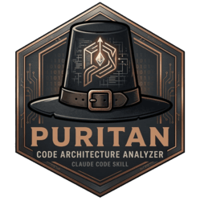

# Puritan

Architectural doctrine enforcement through composable lenses. Define your architecture as auditable rules, then let the Inquisition hold the codebase to them — commit by commit, or across the whole sanctum.

## The three skills

Puritan is three skills that work together as a cycle:

```
/puritan:covenant      →   decide what patterns to use, generate config
         ↓
/puritan:inquisition   →   audit code against configured doctrines
         ↓
/puritan:scriptorium   →   author new doctrines or update existing ones
         ↑_______________________________________________|
```

### Covenant — Architecture Planning (`/puritan:covenant`)

Covenant helps you choose architectural patterns before you build, or assess what patterns your existing codebase is already using.

**Modes:**

| Invocation | What it does |
|---|---|
| `/puritan:covenant` | Full analysis — pattern recommendations + phased implementation roadmap |
| `/puritan:covenant discover` | Lightweight codebase scan → detects patterns from directory structure → generates `.architecture/config.yml` |
| `/puritan:covenant assess` | Gap analysis of your current architecture against your stated patterns |
| `/puritan:covenant roadmap` | Phased implementation plan (assumes patterns already chosen) |
| `/puritan:covenant risks` | Architecture risk analysis and mitigation strategies |

**Discover mode** is the fastest way to get started on an existing codebase. It reads directory structure only (no file contents), infers likely patterns from folder names and signal files, confirms with you, then writes `.architecture/config.yml` ready for Inquisition.

Covenant is also invoked automatically by Inquisition if no config file is found — it offers to run discovery before giving up.

---

### Inquisition — Code Audit (`/puritan:inquisition`)

Inquisition audits your codebase against the doctrines configured in `.architecture/config.yml`. It dispatches parallel subagents per doctrine and collates a structured violation report.

**Modes:**

| Invocation | Scope |
|---|---|
| `/puritan:inquisition` | Changed files only (git diff against base branch) |
| `/puritan:inquisition full` | Entire codebase |
| `/puritan:inquisition interactive` | Full codebase, interactive — fix violations one by one |
| `/puritan:inquisition <doctrine>` | Changed files, single doctrine only |

**Large codebase guard:** If the configured targets exceed 100 files, Inquisition pauses and tells you how many files across how many directories it found. You can proceed, narrow the scope, switch to changed-files mode, or focus on a single doctrine.

**Violations are classified by severity:**
- `error` — correctness violation; blocks commit
- `warning` — quality concern; advisory

**Strictness levels** (per doctrine in `.architecture/decisions.yml`):
- `strict` — all violations kept at original severity
- `pragmatic` — allowed exceptions become warnings
- `aspirational` — all violations become warnings

---

### Scriptorium — Doctrine Authoring (`/puritan:scriptorium`)

Scriptorium writes new architecture doctrine files, or updates existing ones. It researches the pattern from authoritative sources, structures the doctrine to the required format, and places it in the `doctrines/` directory ready for Inquisition to use.

Invoke when you want to:
- Codify an informal team rule into an auditable doctrine
- Add a doctrine for a pattern not yet covered
- Update an existing doctrine with new rules
- Convert an architecture ADR into doctrine format

Each doctrine is a markdown file with a structured violation catalog — typically 20–50 rules across 5–8 categories — each with a concrete detection pattern that Inquisition can check via grep/AST.

---

## Doctrines included

| Doctrine | Prefix | Focus |
|---|---|---|
| **DDD** | `DDD` | Domain-Driven Design — aggregates, value objects, layer boundaries |
| **CQRS** | `CQR` | Command/Query separation — read/write isolation, projections |
| **Event Sourcing** | `EVS` | Append-only event log — immutability, replay, snapshots |
| **Hexagonal** | `HEX` | Ports and adapters — core isolation, dependency direction |
| **Saga** | `SAG` | Distributed transactions — orchestration, compensation, idempotency |
| **Messaging** | `MSG` | Async communication — delivery guarantees, idempotency, dead letters |
| **Microservices** | `MIC` | Service boundaries — independence, contracts, blast radius |
| **Modular Monolith** | `MON` | Module isolation — public API enforcement, cross-module access |
| **Backend for Frontend** | `BFF` | Client-specific backends — aggregation, response shaping |
| **Resilience** | `RES` | Fault tolerance — circuit breakers, retries, bulkheads, timeouts |
| **Layered N-Tier** | `LNT` | Classic layering — presentation, business, persistence separation |

Each doctrine also includes **Detection Signatures** — a lightweight set of directory and file signals that Covenant's discover mode uses to fingerprint which patterns your codebase is using, without running a full audit.

---

## Configuration

### `.architecture/config.yml`

Tells Inquisition which doctrines to apply and which directories to scan:

```yaml
doctrines:
  - name: ddd
    enabled: true
    targets:
      - domain/
      - application/

  - name: cqrs
    enabled: true
    targets:
      - domain/commands/
      - infrastructure/projections/

layers:
  domain:
    - domain/
  application:
    - application/
  infrastructure:
    - infrastructure/

exclude:
  - "**/migrations/**"
  - "**/vendor/**"
  - "**/*.generated.*"
```

Generate this automatically with `/puritan:covenant discover`.

### `.architecture/decisions.yml` (optional)

Override severity per doctrine or per rule:

```yaml
strictness:
  ddd: strict
  cqrs: aspirational

overrides:
  DDD-004:
    severity: warning
    reason: "Team decision: Pydantic for domain validation"
```

---

## Typical workflow

**Greenfield project:**
1. `/puritan:covenant` — discuss patterns, get recommendations and a roadmap
2. Implement your architecture
3. `/puritan:inquisition` — run on each PR to catch violations early
4. `/puritan:scriptorium` — add doctrines as new patterns are adopted

**Existing codebase:**
1. `/puritan:covenant discover` — scan directory structure, generate config
2. `/puritan:inquisition full` — full audit to establish baseline
3. Set non-critical doctrines to `aspirational` to avoid noise while cleaning up
4. `/puritan:scriptorium` — codify any informal rules the team already follows

---

## Voice

The Witchfinder delivers all findings formally and precisely, with a knowing wink. Violations are heresies. Fixes are absolution. The codebase is the sanctum. The persona is flavour — every verdict remains technically unambiguous.
