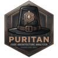

# Puritan

Architectural doctrine enforcement through composable lenses.

## Skills

- **Covenant** (`/puritan:covenant`) — Architecture planning and pattern selection
- **Inquisition** (`/puritan:inquisition`) — Code audit against configured doctrines
- **Scriptorium** (`/puritan:scriptorium`) — Create new architecture doctrines

## Doctrines Included

- DDD (Domain-Driven Design)
- CQRS (Command Query Responsibility Segregation)
- Event Sourcing
- Messaging & Async Communication
- Saga Pattern
