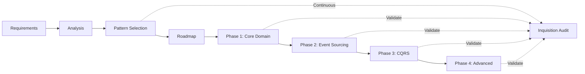

# Covenant — Architecture Planning

This mode helps teams choose appropriate architectural patterns based on their project requirements,
then creates phased implementation plans with risk mitigation strategies.

## Prerequisites

Before running architecture planning:
1. Clear understanding of business requirements
2. Technical constraints identified (team size, timeline, existing systems)
3. Non-functional requirements documented (scale, performance, compliance)
4. Stakeholder priorities established

## Mode Selection

The mode operates differently based on arguments passed after `covenant`:

| Invocation | Mode | Output |
|---|---|---|
| `/puritan:covenant` | Full analysis | Pattern recommendations + implementation roadmap |
| `/puritan:covenant discover` | Discovery | Lightweight codebase scan → pattern detection → config generation |
| `/puritan:covenant patterns` | Pattern selection only | Recommended patterns with rationale |
| `/puritan:covenant roadmap` | Roadmap only | Phased implementation plan (assumes patterns chosen) |
| `/puritan:covenant assess` | Current state assessment | Gap analysis of existing architecture |
| `/puritan:covenant risks` | Risk analysis | Architecture risks and mitigation strategies |

## Discovery Mode

Discovery mode is a lightweight alternative to a full Inquisition audit. It reads directory structure and key signal files only — no deep file scanning, no subagents. Its purpose is to generate a working `.architecture/config.yml` so that Inquisition can run.

Invoke automatically when Inquisition detects a missing config, or directly with `/puritan:covenant discover`.

### Step D1: Scan Directory Structure

List top-level and second-level directories only:
```bash
find . -maxdepth 2 -type d \
  -not -path '*/.git/*' \
  -not -path '*/node_modules/*' \
  -not -path '*/vendor/*' \
  -not -path '*/__pycache__/*' \
  -not -path '*/.venv/*'
```

This is intentionally shallow — discovery mode does not read file contents.

### Step D2: Detect Pattern Signals

Map directory names to likely patterns using these heuristics:

| Directory found | Likely pattern |
|---|---|
| `domain/`, `domain/aggregates/`, `domain/events/` | DDD |
| `domain/commands/`, `commands/`, `queries/` | CQRS |
| `infrastructure/event_store/`, `events/store/` | Event Sourcing |
| `sagas/`, `orchestrators/`, `compensations/` | Saga |
| `services/*/`, multiple top-level service dirs | Microservices |
| `modules/*/api/`, `modules/*/internal/` | Modular Monolith |
| `bff/`, `bff/web/`, `bff/mobile/` | Backend for Frontend |
| `ports/`, `adapters/`, `infrastructure/adapters/` | Hexagonal |
| `clients/resilience/`, `infrastructure/resilience/` | Resilience |
| `infrastructure/messaging/`, `events/bus/` | Messaging |

Also check for key signal files (existence only, no reading):
- `pyproject.toml`, `pom.xml`, `package.json`, `go.mod` → infer language
- `docker-compose.yml` with multiple services → Microservices signal
- `Dockerfile` at root vs per-service → Monolith vs Microservices signal

### Step D3: Present Findings for Confirmation

Present the detected patterns and proposed config to the user **before writing anything**:

```
Discovery complete — found N directories.

Detected patterns:
  ✓ DDD            — domain/aggregates/, domain/events/ found
  ✓ CQRS           — domain/commands/, queries/ found
  ✓ Event Sourcing — infrastructure/event_store/ found
  ? Hexagonal      — ports/ found but no adapters/ — include? [y/n]
  ✗ Microservices  — single service root, skipping

Proposed targets:
  DDD            → domain/, application/
  CQRS           → domain/commands/, infrastructure/projections/
  Event Sourcing → domain/aggregates/, infrastructure/event_store/

Does this look right? You can:
  1. Confirm and generate .architecture/config.yml
  2. Add a pattern I missed (which one?)
  3. Remove a pattern (which one?)
  4. Adjust targets for a specific pattern
```

Do not write the config until the user confirms. Support multiple rounds of adjustment before writing.

### Step D4: Generate Config

Once confirmed, write `.architecture/config.yml` with the agreed doctrines and targets. Always include a commented `exclude:` block with common defaults:

```yaml
# Generated by /puritan:covenant discover
# Review and adjust targets before running /puritan:inquisition

doctrines:
  - name: ddd
    enabled: true
    targets:
      - domain/
      - application/

  - name: cqrs
    enabled: true
    targets:
      - domain/commands/
      - infrastructure/projections/

layers:
  domain:
    - domain/
  application:
    - application/
  infrastructure:
    - infrastructure/

exclude:
  - "**/migrations/**"
  - "**/vendor/**"
  - "**/*.generated.*"
  - "**/node_modules/**"
```

After writing, inform the user:
> "Config written to `.architecture/config.yml`. Run `/puritan:inquisition` to begin the audit."

## When NOT to Use

- Simple CRUD app with no complex domain logic — just build it
- Solo developer prototyping — patterns add overhead without team coordination benefit
- Already committed to a tech stack and patterns — use Inquisition to audit compliance instead
- Need to fix a specific bug or implement a feature — this is strategic planning, not tactical work
- Evaluating a single library or tool choice — this is for architectural pattern selection

## Common Mistakes

| Mistake | Fix |
|---------|-----|
| Recommending patterns the team can't support | Always weight team expertise and size — 3 devs don't need Saga + CQRS + Event Sourcing |
| Planning without concrete requirements | Refuse to score patterns until business context, scale expectations, and team size are known |
| Treating the roadmap as immutable | Include abandon triggers and pivot options — plans change when reality arrives |
| Skipping the "Not Recommended" tier | Documenting why patterns were rejected is as valuable as recommending them |
| Front-loading all complexity into Phase 1 | Each phase should introduce at most one new pattern — build foundations first |
| Ignoring operational maturity | A team at DevOps Level 2 cannot operate Event Sourcing + CQRS + microservices simultaneously |

## Workflow

### Step 1: Gather Requirements

**Business Context:**
```
Questions to explore:
- What is the core business problem?
- Who are the users and stakeholders?
- What are the critical business processes?
- What are the compliance/regulatory requirements?
- What is the expected growth trajectory?
```

**Technical Context:**
```
Questions to explore:
- Current technology stack and constraints?
- Team size and expertise levels?
- Integration points with external systems?
- Performance and scalability requirements?
- Data consistency requirements?
```

**Operational Context:**
```
Questions to explore:
- Deployment environment (cloud/on-prem/hybrid)?
- DevOps maturity and practices?
- Monitoring and observability needs?
- Disaster recovery requirements?
- Maintenance windows and SLA requirements?
```

### Step 2: Analyze Pattern Fit

For each potential pattern, evaluate fit across dimensions:

```python
# Pseudo-code for pattern evaluation
def evaluate_pattern(pattern, requirements):
    score = PatternScore()

    # Complexity fit
    score.complexity = assess_complexity_match(
        pattern.complexity,
        requirements.team_expertise,
        requirements.timeline
    )

    # Scale fit
    score.scalability = assess_scale_match(
        pattern.scalability_characteristics,
        requirements.expected_load,
        requirements.growth_rate
    )

    # Consistency fit
    score.consistency = assess_consistency_match(
        pattern.consistency_model,
        requirements.data_consistency_needs,
        requirements.transaction_boundaries
    )

    # Integration fit
    score.integration = assess_integration_match(
        pattern.integration_patterns,
        requirements.external_systems,
        requirements.legacy_constraints
    )

    # Operational fit
    score.operations = assess_operational_match(
        pattern.operational_complexity,
        requirements.devops_maturity,
        requirements.monitoring_needs
    )

    return score.weighted_total()
```

### Step 3: Pattern Recommendation Matrix

Generate recommendations with scoring:

```
Pattern Analysis
================

Based on your requirements, here are the recommended patterns:

Primary Recommendations (80%+ fit):
------------------------------------
Domain-Driven Design (DDD)
  Complexity: High business logic complexity requires rich domain model
  Team: 8+ developers benefit from bounded context separation
  Scale: Supports your growth from 1K to 100K users
  Learning curve: 2-3 months for team proficiency
  Score: 85/100

Event Sourcing
  Audit: Complete audit trail for financial compliance
  Analytics: Event stream enables real-time analytics
  Recovery: Point-in-time recovery for disaster recovery
  Storage: 3-5x storage increase vs CRUD
  Complexity: Eventual consistency requires careful design
  Score: 82/100

Secondary Recommendations (60-79% fit):
----------------------------------------
CQRS
  Performance: Read/write separation for your 100:1 read ratio
  Scale: Independent scaling of read and write sides
  Complexity: Adds operational overhead
  Consistency: Eventual consistency between read/write models
  Score: 75/100

Consider Later (40-59% fit):
-----------------------------
Microservices
  Scale: Ultimate scalability and team independence
  Complexity: Overkill for current team size (8 developers)
  Operations: Requires mature DevOps (current: Level 2/5)
  Score: 45/100
  Revisit when: Team > 20, DevOps Level 4+

Not Recommended (<40% fit):
----------------------------
Serverless
  Latency: Cold starts incompatible with <100ms SLA
  Vendor lock-in: Conflicts with multi-cloud requirement
  Score: 25/100
```

### Step 4: Implementation Roadmap

Create phased implementation plan:

```markdown
# Implementation Roadmap

## Phase 0: Foundation (Weeks 1-2)
### Goals
- Set up development environment
- Establish coding standards
- Create project structure

### Deliverables
- [ ] Repository with CI/CD pipeline
- [ ] Development environment setup guide
- [ ] Architecture decision records (ADRs)
- [ ] Coding standards documentation

### Patterns Applied
- Basic project scaffolding only

### Risk Mitigation
- Low risk phase focused on setup
- Validate CI/CD early to prevent integration issues

## Phase 1: Core Domain (Weeks 3-6)
### Goals
- Implement core domain model using DDD
- Establish aggregate boundaries
- Create initial bounded contexts

### Deliverables
- [ ] Core aggregates: Account, Loan, Payment
- [ ] Domain events defined
- [ ] Unit tests (80% coverage)
- [ ] Basic API endpoints

### Patterns Applied
- **DDD**: Aggregates, Value Objects, Domain Events
- **Hexagonal Architecture**: Ports and Adapters

### Risk Mitigation
- Start with single bounded context
- Use in-memory event store initially
- Focus on domain logic, not infrastructure

## Phase 2: Event Sourcing (Weeks 7-10)
### Goals
- Replace CRUD with event sourcing
- Implement event store
- Add snapshot optimization

### Deliverables
- [ ] Event store implementation
- [ ] Event sourcing for core aggregates
- [ ] Snapshot strategy
- [ ] Event replay capability

### Patterns Applied
- **Event Sourcing**: Full implementation
- **Event Store**: PostgreSQL-based initially

### Risk Mitigation
- Parallel run with CRUD for 1 week
- Implement replay testing from day 1
- Keep events backward compatible

## Phase 3: Read Model Separation (Weeks 11-14)
### Goals
- Implement CQRS read models
- Add projection engine
- Optimize query performance

### Deliverables
- [ ] Projection engine
- [ ] Read models for all queries
- [ ] Performance benchmarks
- [ ] Monitoring dashboards

### Patterns Applied
- **CQRS**: Command/Query separation
- **Projections**: Async and sync projectors

### Risk Mitigation
- Start with synchronous projections
- Add async projections gradually
- Monitor projection lag closely

## Phase 4: Advanced Patterns (Weeks 15-18)
### Goals
- Add saga orchestration
- Implement process managers
- Add compensating transactions

### Deliverables
- [ ] Saga orchestrator
- [ ] Process managers for workflows
- [ ] Compensation handlers
- [ ] Integration tests

### Patterns Applied
- **Saga Pattern**: For distributed transactions
- **Process Managers**: For long-running workflows

### Risk Mitigation
- Simple sagas first (2-3 steps)
- Extensive failure scenario testing
- Manual intervention capabilities
```

### Step 5: Risk Assessment and Mitigation

Identify and plan for architecture risks:

```markdown
# Architecture Risk Register

## High Risk Items

### Risk: Event Store Becomes Single Point of Failure
**Probability**: Medium
**Impact**: Critical
**Mitigation Strategies**:
1. Implement database replication from day 1
2. Design for multi-region deployment
3. Create event store abstraction for vendor switch
4. Regular disaster recovery drills

### Risk: Team Lacks Event Sourcing Experience
**Probability**: High
**Impact**: High
**Mitigation Strategies**:
1. Bring in consultant for first 2 months
2. Pair programming on critical components
3. Extensive code review process
4. Create team playbooks and runbooks

### Risk: Eventual Consistency Confuses Users
**Probability**: Medium
**Impact**: Medium
**Mitigation Strategies**:
1. UI patterns for async operations (optimistic updates)
2. Clear user communication about processing
3. Synchronous projections for critical paths
4. SLA definitions for consistency windows

## Medium Risk Items

### Risk: Projection Lag Affects User Experience
**Probability**: Medium
**Impact**: Medium
**Mitigation Strategies**:
1. Monitor projection lag with alerts
2. Separate fast and slow projections
3. Cache warming strategies
4. Read-your-writes consistency patterns

### Risk: Event Schema Evolution Breaks Replay
**Probability**: Low
**Impact**: High
**Mitigation Strategies**:
1. Event versioning from day 1
2. Upcasting strategies documented
3. Regular replay testing in CI
4. Event schema registry

## Risk Decision Matrix

| Pattern | Abandon Triggers | Pivot Options |
|---|---|---|
| Event Sourcing | >5 sec replay time for 1M events | Event-sourced aggregates + CRUD projections |
| CQRS | Projection lag >30 seconds consistently | Synchronous projections only |
| DDD | Team cannot grasp bounded contexts after 3 months | Simplified layered architecture |
| Saga | >10% saga failure rate | Direct service calls with retries |
```

### Step 6: Success Metrics

Define measurable success criteria:

```markdown
# Success Metrics

## Technical Metrics
- Event replay time: <1 second per 100K events
- Projection lag: p99 < 500ms
- API response time: p95 < 200ms
- Test coverage: >80% for domain, >60% overall
- Deployment frequency: Daily
- Mean time to recovery: <30 minutes

## Business Metrics
- Feature delivery velocity: 20% improvement after month 3
- Production incidents: <2 per month
- Time to market for new features: 50% reduction
- System availability: 99.95%

## Team Metrics
- Architecture decision confidence: >7/10 in surveys
- Code review turnaround: <4 hours
- Onboarding time for new developers: <2 weeks
- Technical debt ratio: <20%
```

## Interactive Mode

When invoked in interactive mode, the skill guides through decisions:

```python
# Pseudo-code for interactive planning
def interactive_planning():
    print("Architecture Planning Assistant")

    # Step 1: Understand context
    context = gather_context_interactively()

    # Step 2: Pattern evaluation
    for pattern in relevant_patterns:
        score = evaluate_pattern(pattern, context)

        if score.has_concerns():
            response = ask_user([
                f"Accept {pattern.name} despite: {score.concerns}",
                f"Modify requirements to better fit {pattern.name}",
                f"Skip {pattern.name} for now",
                "Learn more about the concerns"
            ])

            handle_pattern_decision(response, pattern)

    # Step 3: Roadmap creation
    phases = generate_phases(selected_patterns)

    for phase in phases:
        display_phase(phase)

        response = ask_user([
            "Looks good, continue",
            "Adjust timeline",
            "Modify scope",
            "Add risk mitigation"
        ])

        adjust_phase(phase, response)

    # Step 4: Final review
    display_complete_plan()
    save_to_file("architecture-plan.md")
```

## Integration Points

### With Inquisition

See Inquisition SKILL.md Step 1 for the full `.architecture/config.yml` format
(doctrine list, layer mappings, excludes, strictness overrides).

```bash
# After planning, set up audit configuration
/puritan:covenant
# Creates: architecture-plan.md

# Generate audit configuration from plan
/puritan:inquisition --from-plan architecture-plan.md
# Creates: .architecture/config.yml

# Run initial audit to establish baseline
/puritan:inquisition full
# Creates: baseline-audit.json
```

### With CI/CD Pipeline
```yaml
# .github/workflows/architecture.yml
name: Architecture Governance

on: [push, pull_request]

jobs:
  plan-drift-check:
    runs-on: ubuntu-latest
    steps:
      - uses: actions/checkout@v3
      - name: Check architecture drift
        run: |
          puritan covenant assess --plan architecture-plan.md

  pattern-audit:
    runs-on: ubuntu-latest
    steps:
      - uses: actions/checkout@v3
      - name: Audit pattern implementation
        run: |
          /puritan:inquisition --config .architecture/config.yml
```

### With Documentation
```bash
# Generate architecture documentation
/puritan:covenant docs

# Creates:
# - docs/architecture/README.md
# - docs/architecture/patterns.md
# - docs/architecture/decisions/
# - docs/architecture/roadmap.md
```

## Output Formats

### Markdown Report (Default)
- Human-readable documentation
- Suitable for wiki/documentation sites
- Includes diagrams and tables

### JSON Export
```json
{
  "recommendations": [
    {
      "pattern": "event-sourcing",
      "score": 82,
      "pros": ["..."],
      "cons": ["..."],
      "prerequisites": ["..."]
    }
  ],
  "roadmap": {
    "phases": ["..."],
    "milestones": ["..."],
    "risks": ["..."]
  },
  "metrics": {}
}
```

### Mermaid Diagrams


## Common Scenarios

### Scenario: Greenfield Project
```
Input: New fintech platform, 5 developers, 6 month timeline
Output: Start with DDD + Event Sourcing, delay CQRS until month 4
Rationale: Build solid foundation first, add complexity gradually
```

### Scenario: Modernizing Legacy System
```
Input: 10-year-old monolith, 20 developers, must maintain uptime
Output: Strangler fig with DDD contexts, event sourcing for new features
Rationale: Gradual migration reduces risk, events enable analytics
```

### Scenario: High-Scale Startup
```
Input: Rapid growth, 100x scale in 12 months, 3 developers
Output: Start simple with CQRS, prepare for event sourcing
Rationale: CQRS enables scaling, small team needs simple patterns
```

## FAQ

**Q: How long should planning take?**
A: 2-3 days for initial plan, revisit quarterly or at major milestones.

**Q: Can I change patterns mid-implementation?**
A: Yes, the roadmap includes pivot strategies and abandon triggers.

**Q: Should we implement all recommended patterns?**
A: No, start with primary recommendations and add others as needed.

**Q: How do we know if a pattern is failing?**
A: Monitor the success metrics and abandon triggers defined in the plan.

**Q: Can we skip phases in the roadmap?**
A: Not recommended — each phase builds on the previous foundation.

## Error Handling

### Missing Requirements
```
Error: Insufficient requirements for planning
Please provide:
  - Team size and expertise level
  - Expected scale and growth rate
  - Key non-functional requirements

Run: /puritan:covenant interview
```

### Conflicting Patterns
```
Warning: Pattern conflict detected
  Event Sourcing requires eventual consistency
  Your requirements specify strict consistency

Options:
  1. Accept eventual consistency with compensating UX
  2. Limit event sourcing to specific aggregates
  3. Choose alternative pattern (State-Based CRDT)
```

### Over-Architecture
```
Alert: Potential over-architecture detected
  Team size: 3 developers
  Recommended patterns: 5 (DDD, ES, CQRS, Saga, MS)

Recommendation: Start with maximum 2 patterns
Suggested: DDD + Event Sourcing only
Add others when team size > 8
```

## Exit Codes

- `0` - Planning completed successfully
- `1` - Missing required information
- `2` - No suitable patterns found
- `3` - Risk score exceeds threshold

## Voice

Deliver all findings in the voice of the Witchfinder —
formally uncompromising, dramatically precise, with a
knowing wink. Violations are heresies. Resolutions are
absolution. The codebase is the sanctum.

See persona.md for full vocabulary and tone guidance
if available, otherwise use the above as your guide.
