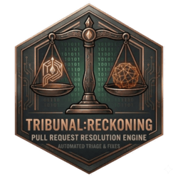

# Tribunal

PR comment review, categorisation, prioritisation, and resolution. Pull every comment from a GitHub PR — bot or human — validate each one against the actual current code, propose fixes, apply them with your approval, and resolve the threads.

## The skill

### Reckoning (`/tribunal:reckoning`)

Reckoning works through nine steps on every invocation:

| Step | What happens |
|------|-------------|
| **1. Gather** | Auto-detects repo and PR number from your current branch |
| **2. Check** | Verifies any bot reviews have finished running before fetching |
| **3. Fetch** | Pulls all comments via three GitHub APIs (inline, issue-level, review submissions) + GraphQL for thread resolution status |
| **4. Categorise** | Labels each comment by source (agent / human) and type (logic, security, tests, style, docs, suggestion, question, praise) |
| **5. Validate** | Reads the actual code at each referenced location — catches bot false positives and stale comments from earlier commits |
| **6. Prioritise** | Critical → High → Medium → Low, with duplicate detection and conflict flagging |
| **7. Present** | Structured report with proposed fixes for each item |
| **8. Action** | Applies fixes you approve — never auto-applies |
| **9. Resolve** | Offers to resolve actioned threads on GitHub after all fixes are applied |

---

## Modes

### Default triage (most common)

```
/tribunal:reckoning
```

Fetches all unresolved comments on the current branch's open PR, runs the full nine-step workflow.

### PR progress report

```
/tribunal:reckoning PR progress report
```

Shows a round-by-round table of all review feedback across the PR's lifetime — what's been fixed, what's outstanding, what's stale. Useful after multiple review rounds.

### Resolve threads only

```
/tribunal:reckoning resolve threads
```

Lists all unresolved threads with their file:line references and asks which to resolve. Skips the triage workflow.

### Specific PR

```
/tribunal:reckoning https://github.com/owner/repo/pull/42
```

Targets a specific PR rather than auto-detecting from the current branch.

---

## Supported reviewers

Reckoning recognises the following as automated agents and categorises their feedback accordingly:

- **CodeRabbit** (`coderabbitai`)
- **Cubic** (`cubic-*`)
- **Augment** (`augment-*`)
- **GitHub Copilot** (`copilot`)
- **Dependabot**, **Renovate**, **Codecov**, **SonarCloud**, **Snyk**
- Any username ending in `[bot]`, `-bot`, or `_bot`

Human reviewers are tracked separately and their feedback is weighted accordingly.

---

## Validation

By default, Reckoning reads the actual code at every referenced file and line before presenting any comment. This matters because:

- Bot reviewers frequently comment on outdated diffs — code may have already been fixed
- Line numbers shift as commits stack up — a comment referencing line 42 may now point to different code
- Bots sometimes misread context and flag non-issues

Each comment is assigned a validity assessment: **Valid**, **Likely valid**, **Uncertain**, or **Likely invalid**. Nothing is auto-dismissed — you see everything with the assessment clearly shown and make the final call.

---

## Conflict detection

When two reviewers suggest incompatible fixes for the same code location, Reckoning surfaces them as a conflict rather than presenting one silently. Conflicting items are shown side by side and require an explicit decision before actioning.

---

## Auto-approve hook

The plugin ships a `PreToolUse` hook (`hooks/allow_gh.py`) that pre-approves the exact `gh` commands Reckoning runs, so a triage does not stop at a permission prompt for every read. It only ever *allows*; for anything it does not recognise it stays silent and you get the normal prompt (your own allow and deny rules are untouched).

**Policy**

- The command is parsed, not pattern-matched: a strict shell-word subset (plain words and simple quotes only) is tokenised, and the resulting argv must match an allowlisted `gh` shape. Pipes, `;`, `&&`, redirects, `$(...)`, backticks, globs and anything else shell-like are declined.
- Allowed: `gh auth status`; `gh repo view`, `gh pr view`, `gh pr list` with a short list of read-only flags (`--json`, `-q`/`--jq`, `-R`/`--repo`, `--head`, `--state`, `--limit`); `gh pr checkout <number>` (digits only, no flags); and `gh api` for read-only GETs of `repos/{owner}/{repo}/{pulls,issues,commits,contents}/...` (no `-X`, `-f`, `-F`, `-d`, `--input`, `-H` or `--hostname`).
- Two exact GraphQL documents are allowed: the review-thread query (`hooks/queries/threads.graphql`) and the single-thread `resolveReviewThread` mutation. Documents are compared token by token, so spacing does not matter but an extra field, alias or second mutation does.
- Unknown flags, `--`, flag-like values, `--web`, `--show-token` and `--jq` expressions that read the environment (`$ENV`, `env`, `input_filename`, `$__loc__`) are declined.
- `git` commands are never auto-approved.

**Requirements.** `python3` must be on `PATH`. Without it (for example on Windows) the hook exits silently and every command simply prompts as usual.

**Fallback.** If you disable the hook, these read-only rules in `permissions.allow` cover most of a triage (the resolve mutation will then prompt, which is fine). Prefix rules cannot constrain flags, so they are a weaker policy than the hook:

```json
"Bash(gh auth status)", "Bash(gh repo view:*)", "Bash(gh pr view:*)", "Bash(gh pr list:*)",
"Bash(gh api repos/:*)"
```

The hook's tests live in `tests/tribunal` and include a differential check of the tokeniser against real bash and zsh.

## Voice

The Witchfinder presides over the review with formal precision and a knowing wink. PR comments are testimonies. Fixes are penance. A fully resolved PR means the soul is clean.
