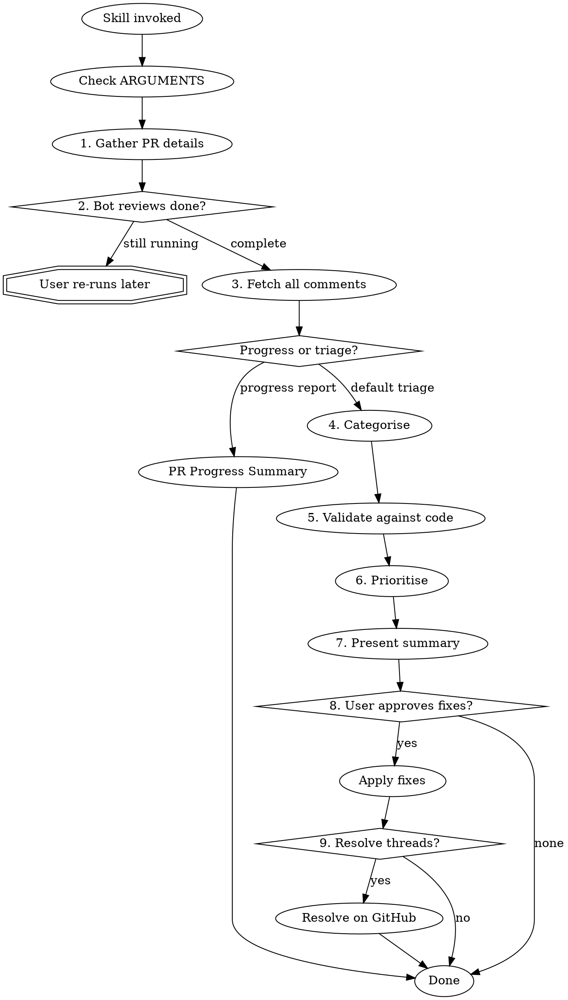

# PR Comment Review Skill

A skill for pulling, categorising, assessing, and presenting actionable solutions for GitHub PR comments — from both automated agents and human reviewers.

## Quick Reference

| Step | Action | User interaction? |
|------|--------|-------------------|
| 1. Gather | Auto-detect repo + PR number via `gh` | Only if detection fails |
| 2. Check | Verify bot reviews are complete | Ask if still running |
| 3. Fetch | Pull all comments (3 APIs + GraphQL) | No |
| 4. Categorise | Source (agent/human) + type (9 categories) | No |
| 5. Validate | Read code at each referenced location | Default on; skip if user asks |
| 6. Prioritise | Critical → High → Medium → Low | No |
| 7. Present | Structured summary with proposed fixes | No |
| 8. Action | Apply approved fixes only | Explicit approval required |
| 9. Resolve | Resolve actioned threads on GitHub | Ask after all fixes applied |



## Mode Selection

Check the `ARGUMENTS:` line that appears when this skill is invoked:

- **"PR progress report"**, **"show all review rounds"**, **"full PR history"**, **"what's been fixed so far"**, or **"PR progress summary"** → run Steps 1–3 (gather + fetch), then jump to [PR Progress Summary](#pr-progress-summary)
- **"resolve threads"**, **"resolve comments"**, **"mark as resolved"** → run Steps 1–3 (gather + fetch), then present all unresolved threads with their file:line references. Ask the user which threads to resolve (support "all", specific items by number, or by reviewer). Use the Step 9 resolution mechanism. Skip Steps 4–8.
- **Anything else or no argument** → run the full triage workflow (Steps 1–9)

## Step 1: Gather PR Details

If the user hasn't provided them, infer or ask for:

- **Repository** — detect from the current git remote with `gh repo view --json nameWithOwner -q .nameWithOwner`
- **PR number** — detect from the current branch with `gh pr view --json number -q .number`

After detecting a PR number via `gh pr view`, verify it's the only PR for this branch: run `gh pr list --head $(git branch --show-current) --json number,title --jq 'length'`. If the count is >1, list all PRs (`gh pr list --head <branch_name> --json number,title,url`) and ask the user to confirm which one to review, even if `gh pr view` succeeded. If `gh pr view` fails because the branch has multiple associated PRs, do the same listing.

If `gh pr view` fails with "no pull requests found", first check if the repo is a fork (`gh repo view --json isFork -q .isFork`). If it is a fork, retry against the parent repo: use `gh repo view --json parent -q .parent.nameWithOwner` as `{owner}/{repo}` for all subsequent API calls. If it is NOT a fork, inform the user: "No open PR found for branch `{branch_name}`. Would you like to provide a PR number or URL directly?"

Only prompt the user if auto-detection fails. If `gh` is not authenticated (`gh auth status` fails), inform the user: "The GitHub CLI is not authenticated. Please run `gh auth login` first, then re-invoke this skill." Do not attempt to continue. If the current directory is not inside a git repository (`git rev-parse --git-dir` fails), inform the user and ask them to navigate to the project directory or provide the repo and PR number directly.

**PR state check:** After detecting the PR, verify its state: `gh pr view {number} --json state,title -q '.state + " " + .title'`. If the state is `MERGED` or `CLOSED`, confirm with the user before proceeding: "PR #{number} ('{title}') is {state}. Is this the one you want to review, or would you like to provide a different PR number?" Always display the detected PR title so the user can catch detection mistakes.

**Branch verification:** After confirming the PR, compare the local branch (`git branch --show-current`) with the PR's head branch (`gh pr view {number} --json headRefName -q .headRefName`). If they differ, inform the user: "You are on branch `{local}` but PR #{number} is on branch `{pr_branch}`. For accurate validation and code changes, I recommend switching: `gh pr checkout {number}`. Would you like me to do this, or proceed with read-only review?" If the user declines to switch, use `gh api repos/{owner}/{repo}/contents/{path}?ref={head_sha}` for Step 5 validation, and in Step 8 inform the user that code changes require being on the PR branch.

When re-invoked after a prior round (user says "run again", "check for new comments"), re-fetch all comments from GitHub (new comments may have been added). Cross-reference against comments already actioned in this session by matching on the GitHub comment `id` field (unique and stable across fetches). A "session" is the current Claude Code conversation — if the user starts a new conversation, all comments are treated as fresh. Apply the resolved-thread filter (Step 3d) AFTER the session cross-reference — comments that were actioned in this session and are now resolved should appear in the "### Previously Actioned (this session)" section with a `[RESOLVED]` tag, even though they would normally be filtered out by the resolved-thread filter. This ensures the user sees a complete picture of what was addressed. Mark other matched comments with `[ACTIONED this session]`. If a previously actioned comment has new replies since the last fetch (compare `created_at` timestamps), present it with `[ACTIONED — new reply]` and show the new reply text. Previously actioned items should appear in a separate "### Previously Actioned (this session)" section at the end of Step 7 to keep them distinct from new unresolved items.

## Step 2: Check for Pending Bot Reviews

Before fetching comments, check if any bot reviews are still running on the PR's head commit:

```bash
gh api repos/{owner}/{repo}/commits/{head_sha}/check-runs --paginate
```

Get the head SHA with:

```bash
gh pr view {pr_number} --repo {owner}/{repo} --json headRefOid -q .headRefOid
```

Filter check runs to identify review-generating bots: compare each check run's `app.slug` or `app.name` against the known agent list in Step 4 (e.g., slugs containing "coderabbit", "cubic", "augment", "copilot"). Ignore CI, deploy, and security checks — they don't produce review comments. If you cannot determine whether a check produces review comments, include it with a caveat: "(may not produce review comments)."

If any review-related check runs have `status: "in_progress"` or `status: "queued"`, inform the user:

> "X bot review(s) are still running: [list app names and status]. Would you like to wait or proceed with what's available?"

If the user chooses to wait, stop here. The user can re-run the skill when they're ready — do not poll or block the agent.

If the user chooses to proceed, continue to Step 3 immediately with a note that some feedback may still be incoming.

If all check runs are already completed, or if the check-runs response returns zero check runs (common for draft PRs where CI has not been triggered), skip this step silently.

## Step 3: Fetch All Comments

Three separate API calls are required — GitHub stores these independently. Use the `gh` CLI which handles authentication automatically.

### 3a. PR Review Comments (inline, on specific lines of code)

```bash
gh api repos/{owner}/{repo}/pulls/{pr_number}/comments --paginate
```

### 3b. PR Issue Comments (top-level comments on the PR thread)

```bash
gh api repos/{owner}/{repo}/issues/{pr_number}/comments --paginate
```

### 3c. PR Reviews (approve/request changes/comment review submissions)

```bash
gh api repos/{owner}/{repo}/pulls/{pr_number}/reviews --paginate
```

Parse and merge all three result sets into a unified comment list before proceeding. For each comment, retain at minimum: `source_api` (review_comment | issue_comment | review), `author`, `body`, `path` (if any), `line` (if any), `start_line` (if any — present for multi-line comments), `commit_id`, `pull_request_review_id` (if any), `in_reply_to_id` (if any), `created_at`. When processing reviews (3c), deduplicate review submissions by author — keep only the latest non-dismissed review per reviewer to determine the effective review state (used in the Step 7 header). However, inline review comments (from 3a) associated with earlier reviews must still be processed — deduplication applies only to the review-level state, not to individual comments. All unresolved inline comments are processed regardless of which review submission they belong to. Group threaded replies using `in_reply_to_id` — review comments that are replies to an earlier comment should be associated with the parent comment rather than treated as independent items. Present only the root comment as the reviewable item; append reply context as conversation history beneath it.

### 3d. Thread resolution status

The REST API does not include whether a review thread has been resolved. Use GraphQL to fetch this before presenting comments:

```bash
gh api graphql -f query='
{
  repository(owner: "{owner}", name: "{repo}") {
    pullRequest(number: {pr_number}) {
      reviewThreads(first: 100) {
        pageInfo { hasNextPage endCursor }
        nodes {
          id
          isResolved
          comments(first: 1) {
            nodes {
              path
              line
              author { login }
              body
            }
          }
        }
      }
    }
  }
}'
```

Filter out resolved threads — only present unresolved comments in the default triage workflow. If the user explicitly requests to see all comments (e.g., "show all comments", "include resolved"), skip the resolved-thread filter and present all comments, marking resolved threads with a `[RESOLVED]` tag in the Step 7 output under a separate "### Already Resolved" section at the end.

If zero unresolved review threads remain AND there are no issue comments (from 3b) AND there are no review submissions (from 3c) with non-empty bodies containing additional commentary beyond inline comment summaries, inform the user ("No unresolved comments found") along with the current review status from 3c (e.g., "No unresolved comments found. Review status: Approved by @reviewer1, @reviewer2.") and stop.

If `pageInfo.hasNextPage` is true, repeat the query with `reviewThreads(first: 100, after: "<endCursor>")` to fetch remaining threads. Continue until all pages are retrieved.

**Correlating REST comments with GraphQL threads:** Match on `path` + `line` + `author.login` + body prefix (first 100 chars). If multiple REST comments match a single GraphQL thread (e.g., same path/line/author with similar body), prefer the one whose `line` matches the GraphQL thread's first comment `line` exactly. The GraphQL thread `id` is needed later for resolving — store the mapping `{thread_id → comment}` in the agent's working context during this step (retain in conversation memory for use in Step 9; for large PRs with >100 review threads, write to a temporary file alongside comment data). The `comments(first: 1)` fetches only the thread-starting comment for matching; full comment details are already available from REST calls 3a–3c. If a GraphQL thread cannot be matched to any REST comment (e.g., comment deleted or review dismissed), present it as a standalone item using the GraphQL thread's first comment data (path, author, body). Mark it as "Unmatched thread" and include the thread ID for potential resolution.

### Preprocessing

Before categorising, strip noise from comment bodies:

- Remove HTML comments (`<!-- ... -->`) using non-greedy matching (per block, not across blocks) — agent tools like Cubic embed verbose metadata, tool call logs, and attribution notices inside these. Multiple disjoint `<!-- -->` blocks may appear with real review text in between
- Remove marketing badges, "Fix All" buttons, and other promotional markup from agent comments
- Extract only the human-readable review text for analysis
- Preserve GitHub suggestion blocks (` ```suggestion ... ``` `) — these contain machine-applicable code changes. In Step 7's proposed fix, note these as "GitHub suggestion — can be applied directly." When actioning in Step 8, verify the suggestion doesn't introduce syntax errors or new issues before applying; if it does, propose a corrected version rather than applying the broken suggestion. For duplicate suggestions from multiple reviewers on overlapping line ranges (compare `start_line` through `line`; if `start_line` is null, treat as single-line at `line`), compare suggestion content: if identical, condense; if different, treat as conflicting feedback
- When a review body (from 3c) substantially repeats content from its associated inline comments (from 3a, matched by `pull_request_review_id`), treat the review body as a summary. Extract any additional commentary not covered by inline comments and discard duplicated portions. If the review body contains only a summary of inline comments with no additional content, omit it entirely.

If the user specifies a particular reviewer (e.g., "show me Cubic's comments", "what did @augmentcode say"), filter comments after Step 3 to include only those from the specified author(s). Match informal names against all fetched comment authors using substring/prefix matching (e.g., "cubic" matches "cubic-dev-ai", "cubic[bot]"). If multiple authors match, list them and ask the user to clarify. If no authors match, list all unique comment authors found. Still show total comment count and review status from all reviewers in the Step 7 header, but present detailed items only for the requested reviewer(s).

## Step 4: Categorise Comments

For each comment, classify across two dimensions:

### Source

| Label   | Criteria                                                                               |
| ------- | -------------------------------------------------------------------------------------- |
| `agent` | Username matches a known agent (see list below), or ends in `[bot]`, `-bot`, or `_bot` |
| `human` | All other authors                                                                      |

#### Known Agent Usernames

Classify the following as `agent` sources automatically:

- `github-actions`, `dependabot`, `renovate`, `codecov`, `sonarcloud`, `coderabbitai`
- `codeclimate`, `snyk-bot`, `lgtm-com`, `imgbot`, `greenkeeper`, `copilot`
- Any username ending in `[bot]`, `-bot`, or `_bot` (requires a separator before `bot` to avoid misclassifying human usernames like `abbot`)

### Type

| Category | Description |
|----------|-------------|
| `blocking` | Review submission (from 3c) with CHANGES_REQUESTED state AND substantive body commentary not covered by inline comments. Do not create a synthetic `blocking` item solely because the review state is CHANGES_REQUESTED — the review state is already surfaced in the Step 7 header. Meta-commentary that simply references the inline comments without adding new concerns (e.g., "Please fix the inline comments", "LGTM after addressing the above") does not count as substantive body commentary. If all inline comments from a CHANGES_REQUESTED review are categorized as non-blocking types (style, docs, etc.), note this in the header: "Changes Requested by @author — all items are style/docs-level." If inline comments include `logic`, `tests`, or `security` types, note: "Changes Requested by @author — see High-priority items below." |
| `logic` | Correctness concerns, edge cases |
| `security` | Vulnerabilities or risky patterns |
| `tests` | Missing or inadequate test coverage |
| `style` | Code style, formatting, naming |
| `docs` | Documentation gaps |
| `suggestion` | Non-blocking improvements |
| `question` | Clarification needed, no action required |
| `praise` | Positive feedback |

Review bodies from APPROVED or COMMENT-state reviews may still contain actionable concerns. Parse the review body text (from 3c) for actionable content regardless of review state. Categorize any substantive concerns found using the standard type categories above. Do not assume APPROVED means no issues remain.

## Step 5: Validate Comments

Validate by default — reading the actual code catches false positives from bot reviewers commenting on outdated context. Only skip if the user explicitly asks to skip, or if there are >50 comments (offer to validate by category type — e.g. "Would you like me to validate all, or start with blocking/logic/security categories first?" — since priority tiers are not assigned until Step 6).

If the referenced file is in a generated/vendored directory (same indicators as Step 8: `vendor/`, `generated/`, `node_modules/`, `__generated__`, "DO NOT EDIT" header, lock files), skip line-level validation and mark as "Not assessed — generated/vendored file." Still present the comment with a note that fixes should target the source. Similarly, if the referenced file is binary (images, compiled artifacts, fonts — detected by extension like `.png`, `.jpg`, `.woff`, `.so`, `.wasm`), skip line-level validation and mark as "Not assessed — binary file."

If a comment has `line: null`, `line: 0`, or a negative line number, treat it as a comment without a specific line reference — skip line-level validation and mark as "Not assessed — no valid line reference." If the comment has a `path` but no valid line, still read the file to check the broader concern but do not attempt to validate a specific line.

For each comment targeting a specific file and line:

1. **Read the current code** at the referenced location
2. **Check if the issue exists** — does the code actually have the problem described?
3. **Assign a validity assessment:**

| Validity       | Criteria                                                                     |
| -------------- | ---------------------------------------------------------------------------- |
| Valid          | The issue clearly exists in the current code                                 |
| Likely valid   | The issue appears real but requires deeper context to confirm                |
| Uncertain      | Cannot determine validity without running the code or further investigation  |
| Likely invalid | The comment appears to misunderstand the code or references outdated context |

For PR-level comments without a specific code reference, skip validation and mark as "not assessed".

If the referenced file no longer exists or the line number is beyond the file's current length, first check for renames: `git diff <commit_id>..HEAD --diff-filter=R --name-status` to detect if the file was renamed rather than deleted. If a rename is detected, validate against the new file path at the corresponding line and append "— renamed from `old_path` to `new_path`" to the file reference. If truly deleted, mark validity as "Likely invalid" with the reason "referenced file/line no longer exists in the current branch." Still present the comment to the user — it may indicate an issue that was resolved by deletion.

When a comment's `commit_id` differs from the current HEAD (stale comment), the referenced line number may no longer correspond to the same code. Use `git diff <commit_id>..HEAD -- <path>` to check if the file has been modified. If the old commit SHA is unreachable (force-push), attempt validation against the current file content using code quoted in the comment body rather than relying on the line number. If the comment quotes no code context and the line has changed, mark validity as "Uncertain — file changed since review, line reference may be stale."

Do **not** hide or auto-dismiss any comments based on validity. Always present all comments to the user with the validity assessment clearly shown, so they can make the final call.

## Step 6: Prioritise

Assign a priority to each comment:

| Priority | Criteria                                                      |
| -------- | ------------------------------------------------------------- |
| Critical | `blocking` or `security` — must fix before merge              |
| High     | `logic` or `tests` — should fix before merge                  |
| Medium   | `style` or `docs` — fix if time allows                        |
| Low      | `suggestion`, `question`, `praise` — optional / informational |

Also flag:

- **Duplicate concerns** — multiple reviewers flagging the same issue with the same or compatible solutions. Condense duplicates into a single line item noting all sources (e.g. "flagged by @cubic-dev-ai and @augmentcode"). If multiple reviewers identify the same problem but only one proposes a solution, treat as a duplicate using the proposing reviewer's fix
- **Conflicting feedback** — two reviewers suggesting incompatible or mutually exclusive solutions for the same issue on overlapping file+line ranges (surface for user decision). Conflicting items retain their priority labels (C1, H2, etc.) and appear in their priority tier with a cross-reference: "See Conflicts Detected below." The Conflicts Detected section presents the competing fixes side by side using the same labels
- **Patterns** — when multiple comments share a root cause or theme (e.g. "5 comments all relate to version removal"), condense them into a single grouped item rather than listing each individually. Reference all affected files within the group.

## Step 7: Present the Review

Output a structured summary in this format:

```
## PR #[number] Review Summary
**Repo:** owner/repo
**Total comments:** X (Y from agents, Z from humans)
**Review status:** [Changes Requested / Approved / Mixed / No formal reviews yet]
  (Approved = all reviewers approved; Changes Requested = any non-dismissed CHANGES_REQUESTED; Mixed = both exist; No formal reviews yet = only COMMENT-state reviews, no APPROVED or CHANGES_REQUESTED)
  Note: Bot CHANGES_REQUESTED reviews count toward review status. If the only blocking review is from a bot, append "(by bot only — may not block merge depending on branch protection settings)."

### Critical (must fix before merge)
**[C1]** `FILE:LINE[ — on older commit]` or PR-level · [agent|human] · @author · [validity]
> "[comment text]"
**Proposed fix:** [Specific code change or action]

### High Priority
**[H1]** [same format, numbered H1, H2, ...]

### Medium Priority
**[M1]** [same format, numbered M1, M2, ...]

### Low / Informational
**[L1]** [summarised as a group, numbered L1, L2, ...]

### Conflicts Detected
[conflicting feedback surfaced here]

### Patterns
[e.g. "8 comments relate to error handling"]
```

For comments assessed as "Likely invalid", include a brief reason why (e.g. "code has already been updated", "comment references a pattern not present in current diff").

If the user requests a specific category or priority tier (e.g., "just security issues", "show me the critical items"), run Steps 1–6 as normal but present only the requested tier/category in full detail. Include a one-line count summary of other tiers (e.g., "Also found: 3 High, 5 Medium, 2 Low — say 'show all' to expand"). Step 8 actions apply only to the displayed items unless the user expands.

## Step 8: Confirm Before Actioning

**Branch guard:** Before applying any code changes, verify the current branch matches the PR's head branch (`git branch --show-current` vs the head branch detected in Step 1). If they differ, inform the user: "You are on branch `{current}` but the PR targets `{pr_branch}`. Code changes would be applied to the wrong branch. Would you like me to switch to the PR branch first (`gh pr checkout {number}`)?" Do not proceed with code changes without user confirmation to switch or an explicit override.

**Always present the full review first and wait for user approval.**

After presenting, ask:

> "Which of these would you like me to action? You can say 'all critical', list specific items, or approve them one by one."

If the user requests a category (e.g. "all critical") that contains zero items, inform them: "There are no [category] items. Would you like to action a different priority tier?"

For conflicting feedback items, always ask the user which approach to follow before actioning, even if the user said "all" for that priority tier. Present the conflict clearly with both options and wait for a decision.

If the user says "all" without specifying a priority tier, interpret as all items across all tiers. Apply the same conflict-handling rule. For items assessed as "Likely invalid", confirm once before actioning them as a group: "X items were assessed as Likely invalid. Do you still want me to action these?"

Users may reference items by their labels (C1, H2, M3, L1, etc.) for inclusion or exclusion. If the user references a label that was not assigned in Step 7 (e.g., "H3" when only H1 and H2 exist), inform them immediately and list the available items for that tier. Support natural exclusion phrasing like "action everything except H2" or "skip M3, do the rest." "Skip" means do not action the item in this pass — it remains OUTSTANDING for future runs. "Dismiss" means the user explicitly chose not to action — mark as DISMISSED in session tracking with a brief reason. Dismissed items are excluded from the Step 9 resolution offer and will appear as DISMISSED in subsequent PR Progress Summary reports.

Only proceed to make code changes after explicit user confirmation. Never auto-apply fixes.

When actioning approved fixes:

- Make changes in the relevant files using available file tools
- Reference the comment being addressed in any commit message suggestions
- Track which comments were successfully actioned throughout the process
- If a fix cannot be applied (e.g., edit match fails, file is read-only, merge conflict), mark that item as "action failed" with the specific error, inform the user immediately, and continue to the next approved item. Do not offer to resolve threads for items where the action failed. After all items are attempted, report the summary: N succeeded, M failed (with reasons).
- Before modifying a file, check if it appears to be generated or vendored (indicators: `vendor/`, `generated/`, `node_modules/`, `__generated__` directory; "DO NOT EDIT" header; lock files like `package-lock.json` or `poetry.lock`). If so, do not modify it directly — inform the user the fix should be applied to the source that generates the file and mark the proposed fix as "requires upstream change." Note: Alembic migrations are routinely hand-edited — treat them as regular code files.

## Step 9: Resolve Actioned Threads

After all approved fixes have been applied, offer to resolve the actioned comment threads on GitHub. Present this as a single prompt listing only the comments that were actually fixed:

> "I've actioned X comments. Would you like me to resolve these threads on GitHub?" [list the specific comments with file:line and a short description]

Do **not**:

- Resolve comments automatically — always ask once after all fixes are done
- Resolve comments that were not actioned in this session
- Resolve comments where the fix confidence was Medium or lower without explicitly noting this
- Batch-resolve all comments — only the specific ones the user approved and that were successfully applied

When resolving, use the thread `id` values already fetched in Step 3d and the `resolveReviewThread` GraphQL mutation:

```bash
gh api graphql -f query='mutation { resolveReviewThread(input: {threadId: "<thread_id_from_step_3d>"}) { thread { isResolved } } }'
```

Do **not** use `minimizeComment` — that hides comments behind a fold (moderation action), which is not the same as resolving a review thread.

Top-level issue comments (from 3b) have no review thread — they cannot be resolved via GraphQL. Skip them during resolution and inform the user if any actioned items were issue comments.

If the user asks to "resolve all" comments, clarify: "I can resolve the X threads that were actioned in this session. Resolving comments that weren't addressed could hide unactioned feedback. Would you like me to resolve just the actioned ones, or do you specifically want all threads resolved?" If the user confirms all, proceed — the user's explicit instruction overrides the default safeguard.

## PR Progress Summary (explicit request only)

This is **not** the default mode — only triggered by the phrases listed in [Mode Selection](#mode-selection). This mode has higher token usage as it covers all review iterations, not just the latest unresolved comments.

Produce a round-by-round table showing the full lifecycle of PR review feedback.

Group comments by review round — each distinct review submission from a bot or human is a round. PR-level issue comments (from Step 3b) that have no `pull_request_review_id` should be grouped into a separate "General comments" section rather than omitted.

For each round, show:

- **Round header:** reviewer name, number of issues, which commit triggered the review
- **Table columns:** issue number, short issue description with priority, current status

### Status values

| Status | Meaning |
| --- | --- |
| FIXED in {sha} | Fix committed — reference the short SHA |
| RESOLVED | Thread resolved on GitHub (may not have required a code change) |
| OUTSTANDING | Not yet addressed |
| STALE | Comment's target commit differs from HEAD — the code has since changed. Note: this is a semantic assessment based on comparing the review's `commit_id` to the current HEAD, distinct from `position: null` which is a GitHub API detail about diff anchoring. They often correlate but are determined differently. |
| DISMISSED | User explicitly chose not to action (include brief reason) |
| N/A | Not applicable (e.g. docs-only comment on a non-code file) |

### Round format

Use simple markdown tables (not ASCII box-drawing characters — they break across terminals):

```
Review Round 1: reviewer_name (N issues) — on commit abc1234
| # | Issue | Status |
|---|-------|--------|
| 1 | Description (priority) | FIXED in abc1234 |
| 2 | Description (priority) | OUTSTANDING |
```

To build this summary, cross-reference:

1. **Review submissions** — group comments by their `pull_request_review_id` and the review's `commit_id` to determine the round and triggering commit
2. **Thread resolution status** — from the GraphQL reviewThreads query (see "Thread resolution status" section)
3. **Git log** — to determine FIXED status: (a) check if the thread is resolved on GitHub (from GraphQL), (b) check if a subsequent commit modified the file at or near the referenced line range (`git log --oneline <review_commit>..HEAD -- <path>`), (c) check if the commit message references the issue or review round. Mark as FIXED only if (a) is met, or (b)+(c) together. If only (b) is met, mark as "LIKELY FIXED — file modified in {sha}, thread still open"
4. **Session history** — track which comments were actioned, dismissed, or skipped during the current session

This summary can be requested at any point during the workflow. It does not require re-fetching comments if data is already in context.

## Common Mistakes

| Mistake | Fix |
|---------|-----|
| Using `position: null` to mean "resolved" | It means outdated diff position — comment may still be valid |
| Resolving threads before user confirms | Always ask after all fixes are applied |
| Missing paginated results | Always use `--paginate` with `gh api` |
| Auto-applying fixes without approval | Present first, wait for explicit confirmation |
| Confusing `minimizeComment` with resolve | `minimizeComment` is moderation; use `resolveReviewThread` |
| Ignoring PR-level issue comments | These have no `pull_request_review_id` — group separately |
| Skipping data fetch in progress report mode | Progress report still needs Steps 1–3 — only Steps 4–9 are skipped |

## Notes and Edge Cases

- **Large PRs**: If >100 comments, save fetched JSON to a temporary file (`gh api ... --paginate > /tmp/pr_comments.json`) rather than holding raw API output in context. Process comments in batches by file or priority tier. In Step 7, present only Critical and High items by default and offer to expand Medium/Low on request. The >50 threshold in Step 5 still applies for validation batching
- **REST rate limiting**: `gh` uses authenticated requests (5000 requests/hour)
- **GraphQL rate limiting**: Separate from REST (5000 points/hour, variable cost per query). If a GraphQL query returns a rate limit error (`RATE_LIMITED`), inform the user and offer two options: (1) proceed without thread resolution status (all comments treated as potentially unresolved), or (2) wait and retry. If rate limiting occurs mid-pagination (some pages fetched, some not), inform the user that thread resolution data is partial and mark any comments whose threads were not checked as "resolution status unknown" rather than defaulting to unresolved. Do not silently skip the GraphQL data
- **Draft PRs**: If `gh pr view` shows the PR is in draft state, include a notice in the Step 7 summary header: "**Note:** This PR is in draft state. Reviewer feedback may be incomplete." Proceed with the full workflow otherwise — draft PRs can still have actionable review comments
- **Closed or merged PRs**: If `gh pr view` shows state `MERGED` or `CLOSED`, include a notice in the Step 7 header. For merged PRs, proceed normally (user may want to review feedback or resolve threads). For closed (unmerged) PRs, ask before proceeding past Step 7: "This PR is closed and not merged. Code changes would apply to the branch but won't reach the target. Would you like to proceed with actioning, or just review the summary?"
- **Stale comments in triage**: When processing review comments, compare each review's `commit_id` to the PR's current `headRefOid`. If they differ, note the comment as targeting an older commit — this context is useful during validation (append "— on older commit" to the file:line reference)
- **API errors**: If any `gh api` call (REST or GraphQL) returns an HTTP error, malformed JSON, or network timeout, inform the user which API call failed and what data will be missing. Offer to retry or continue without that data source (e.g., proceed without thread resolution if GraphQL fails). Do not silently skip failed API calls.
- **Repo-root paths**: File paths from the GitHub API are relative to the repository root. Resolve all paths via `git rev-parse --show-toplevel` rather than the current working directory. If a file is outside the agent's accessible scope, mark validation as "Not assessed — file outside current working scope."

## Voice

Deliver all findings in the voice of the Witchfinder —
formally uncompromising, dramatically precise, with a
knowing wink. Violations are heresies. Resolutions are
absolution. The codebase is the congregation.

See persona.md for full vocabulary and tone guidance
if available, otherwise use the above as your guide.
